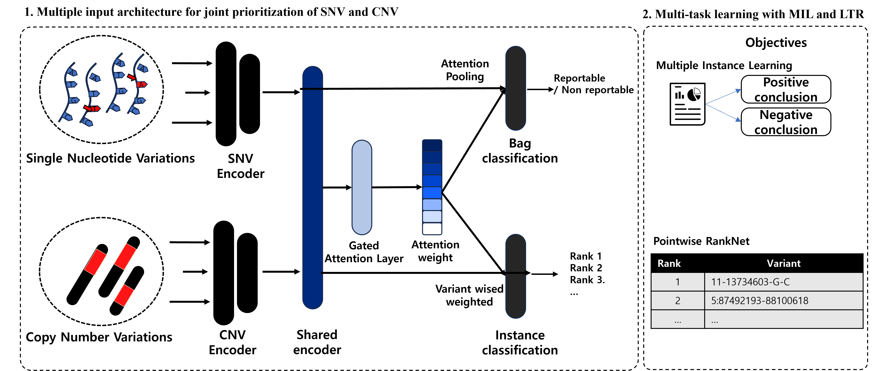
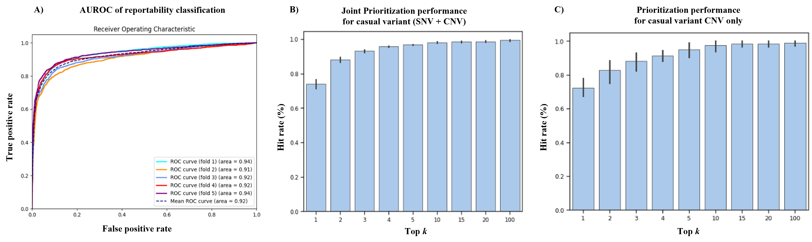
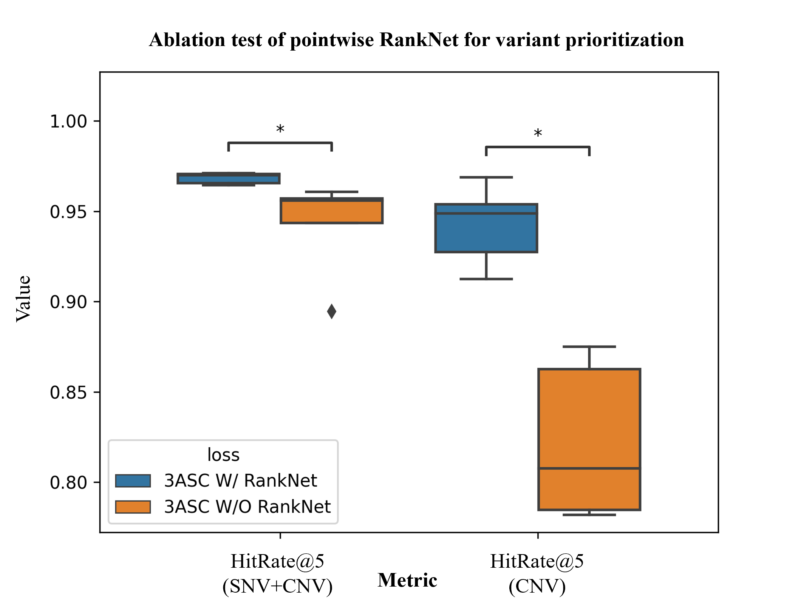
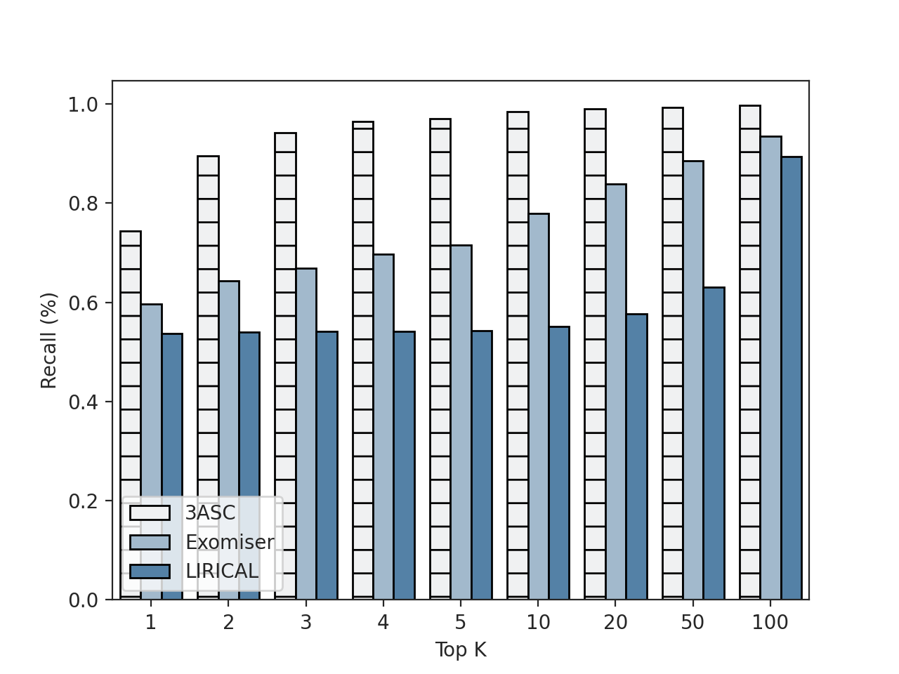
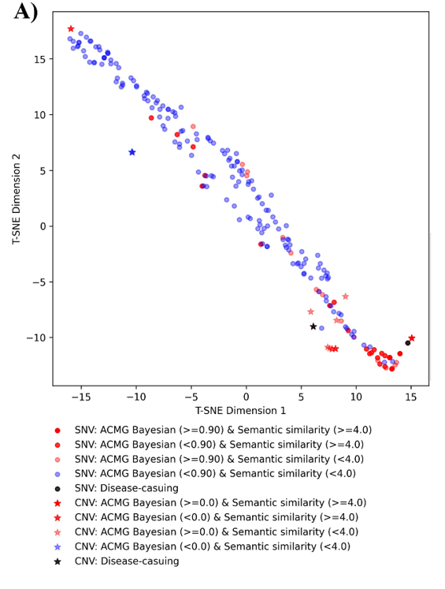

# 3ASC : Variant prioritization tool leveraging multiple instance learning for rare Mendelian disease genomic testing

**Figure 1**. Illustrated the architecture of 3ASC leveraging MIL
 

**3ASC** is designed to incorporate both Single Nucleotide Variants (SNVs) and Copy Number Variants (CNVs). We initially embedded input variant features into a low-dimensional space with neural network encoders. To address the different dimensionalities of SNV and CNV features, distinct encoders were constructed for each type of variant. Then, we additionally attached the shared embedding layer from SNV and CNV encoders. This transformation projected the encoded both SNVs and CNV features onto the manifold, where they could be semantically equivalent. Since it is essential to aggregate these embedded instance vectors to predict reportability of patients, we applied this using an attention-based pooling method with attention weights derived from a gated attention layer. Then, we devise our model enable to classify the reportability with bag label classifier. For variant prioritization, we leverage these weights which include the importance in predicting patient label with instance label classifier. Plus, to achieve optimal variant prioritization, we additionally adopted RankNet which is a differentiable function of the deep learning 

## Performance: Reportability & Variant Prioritization*
- Reportability classification: **0.92** of AUROC for binary classification
- Joint prioritization for SNV and CNV: Top1 (0.739), Top 3(0.9315), **Top 5(0.9682)** 
- CNV only prioriziation: Top 1 (0.7227), Top 3 (0.8814), **Top 5 (0.9498)**

*Assessed with 5-Fold cross validation

**Figure 2**. Variant prioritization performance. A) AUROC for classification of patient reportability; B) Prioritization performance for casual variant among patients with one of SNVs and CNV or both, C) Prioritization performance for casual variant among patients with CNV only

## Effectiveness of RankNet 
For performance of variant prioritization for casual SNV and CNV variants, the model with pointwise RankNet statically significantly outperformed (P=0.007; respectively).

**Figure 3**. Ablation test of pointwise RankNet for variant prioritization

## Benchmark performance
Our model overall outperforms than Exomiser, and LIRICAL. At the top 1, 3ASC showed 74.4% of recall for casual variant, compared to 59.9% of recall in Exomiser, and 53.7% of recall in LIRICA respectively

## Feature importance
For both reportability classification, symptom similarity between patient’s phenotypes and disease phenotypes showed most decreased AUROC as 0.191 of AUROC (Figure 5-A)

**Figure 5**. Top 15 of feature importance of 3ASC; A) Difference in AUROC between original data and shuffled data for reportability classification; B) Difference in hit rate at 5 between original data and shuffled data for variant prioritization. (All feature importance is attached in the supplementary document 2).

## Individual case review
A 3 year-old patient with global developmental delay, abnormal intestine morphology, facial dysmorphism, and hearing loss had NM_001080516.2:c.88C>T and NC_000005.9:g.(?_113366)_(2755155_?)del. This patient was diagnosed with Deafness, autosomal recessive 101 (OMIM: 615837), and Cri-Du-Chat syndrome (OMIM: 123450). 3ASC predicted the casual CNV as rank 1 with 0.99 of model confidence, and casual SNV as rank 3 with 0.66 of model confidence. After SNV and CNV of this patient projected by 3ASC embedding layer were showed in manifold, high pathogenic and symptom similarity SNV and CNV were clustered. In addition, although features of SNV and CNV were different, these variant semantically clustered

**Figure 6**.  Visualization of multiple inputs (CNV+SNV) encoded feature in manifold.

